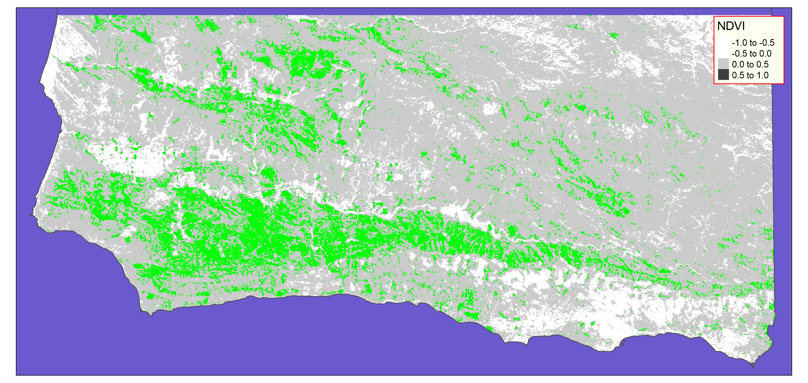

```{r setup, echo = TRUE, message = FALSE, warning = FALSE}
knitr::opts_chunk$set(echo = TRUE, message = FALSE, warning = FALSE)

library(tidyverse)
library(here)
library(sf)    ### vector data functionality
library(terra) ### raster data functionality
library(tmap)
```

# Rasters

Here is a great introduction to rasters in general, and rasters in R specifically: https://geocompr.robinlovelace.net/spatial-class.html#raster-data.  For this lab, will just skim the surface.  There is also an EcoDataScience tutorial on rasters that goes into a bit more detail and provides some other methods of working with such data.  Here is the repo for that tutorial: https://github.com/eco-data-science/eds_rasters.

A brief history of raster packages in R:

* The [`raster` package](https://cran.r-project.org/web/packages/raster/index.html) was originally developed in 2010, and remains a pretty powerful package for working with gridded raster data in R.  
    * I used this package up until about spring 2022 when I started using the `terra` package once it seemed sufficiently stable (the functionality was in place, and the big bugs were all worked out).
* The [`terra` package](https://cran.r-project.org/web/packages/terra/index.html) is a complete redesign of the `raster` package.
    * `terra` provides similar functionality to `raster`, with functions that are either familiar or more simple than those in `raster`.  It is also generally much faster than `raster`.  
    * While `raster` should still work fine for most needs, it's highly recommended to switch over to `terra` for speed and for future compatibility as RStudio/Posit continues to develop new spatial functionality.
* The [`stars` package](https://cran.r-project.org/web/packages/stars/index.html) handles regularly spaced gridded data like `terra` and `raster`, but in a very different format.
    * `stars` is also able to work with a much broader set of gridded data types, generally more complex and less common (e.g., rotated, sheared, and curvilinear grids).  It is designed to work well with multi-layer data as "raster data cubes" e.g., data with multiple spectral bands, multiple moments in time, and/or multiple attributes.
    * `stars` seems to be designed to work more closely with functions and objects from the `sf` package.  I suspect that in the long run, `stars` will supplant `terra` as the preferred package for gridded data.
    * I have not yet found the need to work with `stars` and probably won't worry about it until it reaches a v1.0 release (currently it's at v0.6).

# The Data

## About the Landsat data

Here we're loading a raster saved as a GeoTIFF format (ending in .tif).  This is probably the most common raster file type but there are others.  NetCDF (often with a .nc extension) is another format that is often seen with environmental and remote sensing data.

Data source: Landsat 7 ETM+, USGS, 2005 (borrowed from Frew).  Landsat 9 is the most recent tech, but we'll keep it old school for now.

Fun facts from the [Landsat 7 page at USGS.gov](https://www.usgs.gov/core-science-systems/nli/landsat/landsat-7?qt-science_support_page_related_con=0#qt-science_support_page_related_con):

> Landsat 7 was launched from Vandenberg Air Force Base in California on April 15, 1999 on a Delta II rocket. The satellite carries the Enhanced Thematic Mapper (ETM+) sensor.

> Landsat 7 carries the Enhanced Thematic Mapper Plus (ETM+) sensor, an improved version of the Thematic Mapper instruments that were onboard Landsat 4 and Landsat 5. Landsat 7 products are delivered as 8-bit images with 256 grey levels. Descriptions of Landsat 7 band designations and comparisons of all Landsat sensors are available.  

> Enhanced Thematic Mapper Plus (ETM+):  

> * Eight spectral bands, including a pan and thermal band:
>   * Band 1 Visible (0.45 - 0.52 µm) 30 m
>   * Band 2 Visible (0.52 - 0.60 µm) 30 m
>   * Band 3 Visible (0.63 - 0.69 µm) 30 m
>   * Band 4 Near-Infrared (0.77 - 0.90 µm) 30 m
>   * Band 5 Short-wave Infrared (1.55 - 1.75 µm) 30 m
>   * Band 6 Thermal (10.40 - 12.50 µm) 60 m Low Gain / High Gain
>   * Band 7 Mid-Infrared (2.08 - 2.35 µm) 30 m
>   * Band 8 Panchromatic (PAN) (0.52 - 0.90 µm) 15 m
> * Ground Sampling Interval (pixel size): 30 m reflective, 60 m thermal

<!--  -->

We'll come back to some of this info later.  Especially note Band 3 and Band 4...

## Loading and inspecting the data

Let's try loading the Landsat raster and see what it looks like.  The `terra::rast()` function can read in a single-layer raster (most common use case), but can also read in the multi-band Landsat data into a single object with multiple layers (in this case, bands 1-5):

```{r}
landsat_file <- here('data/Landsat7.tif')

ls_rast <- terra::rast(landsat_file)
ls_rast
```

Things to note:

* `dimensions`: this is how many cells in x, in y, and how many layers
* `resolution`: each cell represents an area of 30 x 30 in the current CRS (the metadata above tells us 30 m)
* `extent`: what are the corners of the map, in the current CRS
* `crs`: Coordinate Reference System.  Here we're working in NAD83 California Teale Albers, which has EPSG code 3310 for easy reference.
* `min` and `max values`: the cells contain values as low as 0 and as high as 255.

We can also quickly plot it using base `plot` function - we'll use `ggplot` later on.  Because this is a multi-layer raster, let's isolate the first layer.

```{r}
ls_1_rast <- ls_rast[[1]]
plot(ls_1_rast, main = 'LandSat band 1', 
     col = hcl.colors(20), axes = FALSE)
```

Not all that impressive yet...  We can work with layers directly in the `ls_rast` object, but for conceptual simplicity, let's isolate three more layers, and we'll use those to do some calculations.  There are multiple ways to select layers, including `[[x]]` and `$`:

```{r}
ls_2_rast <- ls_rast[[2]] ### by layer number like above
ls_3_rast <- ls_rast[['Landsat7_3']] ### by layer name
ls_4_rast <- ls_rast$Landsat7_4      ### by layer name
```

## Prepping the data

Since this is a fairly big dataset, and our computers may not be the fastest, we can simplify these rasters by aggregating groups of pixels to easily increase the pixel size (reducing the resolution).  We can also mask out the ocean to focus just on land-based pixels.

### `terra::aggregate()`

Here we'll group neighboring cells together using the `aggregate()` function, to reduce the resolution, but allow our calculations to process much faster. It basically takes a clump of X by X cells and turns that clump into one larger cell, based on some aggregating function (e.g., mean, min, max).

For a real analysis, you'd probably want to keep the finer-scale resolution!  

After you run this chunk, note the dimensions and resolution change.  Aggregating by a factor of 2 reduces the total number of cells by a factor of 4; aggregating by a factor of 3 reduces cell count by a factor of 9.  The basic math operations should remain consistent however, so it's just a nice way to speed up the tutorial.

```{r}
ls_1_r_agg <- terra::aggregate(ls_1_rast, fact = 3, fun = mean)
ls_2_r_agg <- aggregate(ls_2_rast, fact = 3, fun = mean)
ls_3_r_agg <- aggregate(ls_3_rast, fact = 3, fun = mean)
ls_4_r_agg <- aggregate(ls_4_rast, fact = 3, fun = mean)
plot(ls_1_r_agg, col = hcl.colors(n = 20, palette = 'Blues 2'))
plot(ls_2_r_agg, col = hcl.colors(n = 20, palette = 'Greens 2'))
plot(ls_3_r_agg, col = hcl.colors(n = 20, palette = 'Reds 2'))
plot(ls_4_r_agg, col = hcl.colors(n = 20, palette = 'Grays'))
```

Note how the patterns change a bit from layer to layer.  These different bands represent different parts of the electromagnetic spectrum.  Band 1 is blues, band 2 is greens, band 3 is reds, band 4 is near infrared.

### `terra::rasterize` and `terra::mask()`

We can also use another layer (either raster or vector) to "mask" our current layer - dropping any cells in the *current* layer that match up with `NA` in the *mask* layer, i.e., keeping cells in the current layer that match up with a non-`NA` cell in the mask layer.  It doesn't matter what the cell values are in the mask layer, as long as they're not `NA`.

Here we create a raster of SB county land from a shapefile using `terra::rasterize` and then use that to mask out ocean and non-county areas using `terra::mask`.

```{r create mask from polygons}
### read the polygon and transform to correct CRS
sbc_sf <- read_sf(here('data/county.shp')) %>%
  st_transform(crs(ls_1_r_agg))

### rasterize based on our aggregated raster parameters
sbc_rast <- rasterize(sbc_sf, ls_1_r_agg, field = 'OBJECTI')

plot(sbc_rast, main = 'SB County land raster',
     col = 'red', axes = FALSE, legend = FALSE)

writeRaster(sbc_rast, here('data/county.tif'), overwrite = TRUE)
### the overwrite = TRUE is there because I've already created the
### raster once; I don't mind overwriting it, but if I did, then
### overwrite = FALSE (the default) would prevent me from doing so!
```

```{r}
sbc_rast <- rast(here('data/county.tif'))
plot(ls_3_r_agg)
mask(ls_3_r_agg, sbc_rast) %>% plot()

ls_3_r_agg_mask <- mask(ls_3_r_agg, sbc_rast)
ls_4_r_agg_mask <- mask(ls_4_r_agg, sbc_rast)
```

# Working with rasters

All rasters are a grid of same-sized cells (dependent on the units) with numeric values (or `NA`s) assigned to each pixel.  The numeric data contained in rasters can be used for fairly complex calculations quickly and efficiently.  Note, some rasters use numbers to represent categorical data (see the reading above), so performing math on those is not going to get you to a happy place.

## Raster algebra

Pretty much anything you can do algebraically with a vector of numbers, you can do with a raster.  In fact, R basically keeps track of raster cell values as a big vector (under the hood).

```{r math of a single raster}
vec1 <- 1:5
vec1
vec1 * 2
vec1^2

ls_3_r_agg
ls_3_r_agg * 2
log(ls_3_r_agg)
plot(ls_3_r_agg); plot(log(ls_3_r_agg))
```

You can also combine rasters with algebra operations just like you can combine vectors.  NOTE: to combine two rasters in this way, you need to ensure they have the same geographic parameters (CRS, resolution, extent, etc) otherwise you'll get an error.  Here, the cell in one raster is combined with the matching cell in another raster.

``` {r multiple rasters}
vec2 <- 6:10
vec1 + vec2
ls_3_r_agg + ls_4_r_agg
```

## Raster calculations

The `terra` package allows us to combine (single or multiple-layer) rasters into a single (multi-layer) raster object (the opposite of what we did before, pulling out individual layers from a multi-layer object).  Then we can operate on that with summary statistic functions.

``` {r calc}
### build a stack of rasters
ls_stack <- c(ls_1_r_agg, ls_2_r_agg, ls_3_r_agg_mask, ls_4_r_agg_mask)
ls_mean <- mean(ls_stack, na.rm = FALSE)

### remember, ls_1 and ls_2 still include ocean cells but 
### bands 3 and 4 were masked - so they will "poison" the calc,
### dropping those same NA cells (which are ocean)

plot(ls_mean)
```

# Analysis

## NDVI

NDVI, or Normalized Differential Vegetation Index, is a common method of using satellite imagery to detect healthy vegetation cover.  Sunlight reflected from the surface includes red, green, and blue portions of the spectrum, as well as infrared.  But healthy vegetation reflects differently from unhealthy vegetation or non-vegetation due to chlorphyll (see https://physicsopenlab.org/2017/01/30/ndvi-index/ for details).  


So NDVI takes advantage of how chlorophyll works: it absorbs reds (band 3) (and blues, band 1), but strongly reflects near infrared (band 4) (and greens, band 2).


(img from [bioninja](https://ib.bioninja.com.au/standard-level/topic-2-molecular-biology/29-photosynthesis/action-spectrum.html))

Side note: infrared photography takes advantage of how vegetation strongly reflects IR to produce some striking photos:


(img from [kolarivision](https://kolarivision.com/what-is-infrared-photography/))

The formula for NDVI looks like this:
$$NDVI = \frac{NIR - Red}{NIR + Red}$$

Values can range from -1 to 1; usually a score of greater than ~0.2-0.3 is used to denote forest canopy.  Negative values are generally related to clouds or snow fields.

## Calculate NDVI

Using raster algebra, let's calculate NDVI for the county, and then create a function to identify forest cells based on NDVI ≥ 0.3.  We can use the `terra::app` function (similar to `purrr::map()`) to apply our `is_forest()` function across all cells.

```{r}
ndvi_rast <- (ls_4_r_agg_mask - ls_3_r_agg_mask) / (ls_4_r_agg_mask + ls_3_r_agg_mask)
plot(ndvi_rast, axes = FALSE, col = hcl.colors(100, 'RedGreen'))

is_forest <- function(x, thresh = .3) {
  y <- ifelse(x >= thresh, 1, NA)
  return(y)
}

forest_rast <- app(x = ndvi_rast, fun = is_forest)

plot(forest_rast, col = 'green4', main = 'SB forest from NDVI ≥ 0.3',
     axes = FALSE, legend = FALSE)
```

# `ggplot()` and rasters

`ggplot` likes dataframes - not rasters - so we have to convert our raster to a dataframe.  The `as.data.frame(xy = TRUE)` function converts a raster to a dataframe of points - `x`, `y`, and `layer` (or the layer name if it's a named raster layer).

Note: `ggplot` is a little slow with large-ish rasters - the base `plot()` function that we have been using is better optimized but a lot trickier to make look good, especially if you're used to the features of `ggplot`.

## plot NDVI and forest cover

### create dataframes from rasters

```{r}
ndvi_df   <- as.data.frame(ndvi_rast, xy = TRUE) %>%
  rename(ndvi = 3) ### rename column 3

forest_df <- as.data.frame(forest_rast, xy = TRUE) %>%
  rename(forest = 3)
```

### (and can turn dataframes into rasters!)

The `terra::rast()` function can also take a dataframe (with columns in order of `x`, `y`, and cell value aka `z`) and turn it into a raster.  You'll need to supply a coordinate reference system though (e.g., using `terra::crs()` or `sf::st_crs()` on a spatial object with the correct CRS).  

Note, this won't line up perfectly with the original since the extents and some other parameters are different, but if you have gridded data in a non-raster format (e.g., lat-long, x-y) this will help you create a raster that you can then use as your base raster, or project it to the CRS/extent/resolution of an existing base raster.  `terra::project()` is analogous to `sf::st_transform()` for changing the coordinate reference system (and extents/dimensions/resolution) for rasters.

``` {r}
ndvi_r_from_df <- rast(ndvi_df, 
                       type = 'xyz',  ### input data is dataframe with xyz coordinates
                       crs = crs(ndvi_rast))  ### set the CRS
# ndvi_r_from_df; ndvi_rast ### note different extents and dimensions

ndvi2 <- terra::project(ndvi_r_from_df, ndvi_rast)
# ndvi2; ndvi_rast ### same parameters 
all.equal(ndvi2, ndvi_rast %>% setNames('ndvi'))
### small difference in range values; otherwise identical
```

### create the plot! (`ggplot` version)

``` {r}
ggplot() +
  geom_raster(data = ndvi_df, aes(x = x, y = y, fill = ndvi)) +
  geom_raster(data = forest_df, aes(x = x, y = y), fill = 'green', alpha = .5) +
  coord_sf(expand = 0) +
  scale_fill_gradient(low = 'grey30', high = 'grey80') +
  theme_void() +
  theme(panel.background = element_rect(fill = 'slateblue4'))
```

### Create a plot! (`tmap` version)

The `tmap` package is designed to work directly with spatial objects, so no need to turn it into a dataframe...

```{r}
### Start with adding ndvi_rast as a shape, then plot as raster
sbc_ndvi_map <- tm_shape(ndvi_rast %>% setNames('NDVI')) +
  tm_raster(palette = 'Greys') +
  ### next, add another shape (forest_rast)
  tm_shape(forest_rast) +
  ### plot forest_rast as a raster; note the unintuitive way of mapping
  ### a single color, otherwise if I did col = 'green' it fills the map... ???
  tm_raster(col = 'lyr.1', palette = 'green', legend.show = FALSE) +
  ### can add polygons as well, here adding the SB County vector data
  tm_shape(sbc_sf) +
  ### ... and then plotting it as borders (other options as well)
  tm_borders(col = 'grey30') +
  tm_layout(bg.color = 'slateblue',
            legend.position = c('right', 'top'),
            legend.frame = 'red',
            legend.bg.color = 'ivory')

tmap_save(tm = sbc_ndvi_map, filename = here('img/sbc_ndvi_map.png'))

```


# Going further

Would this NDVI approach also work for other layer combos based on differences in absorption/reflectance? e.g., red-green, blue-green, blue-IR?  You have the technology - try it out and compare your results to the "official" NDVI calculation results!

